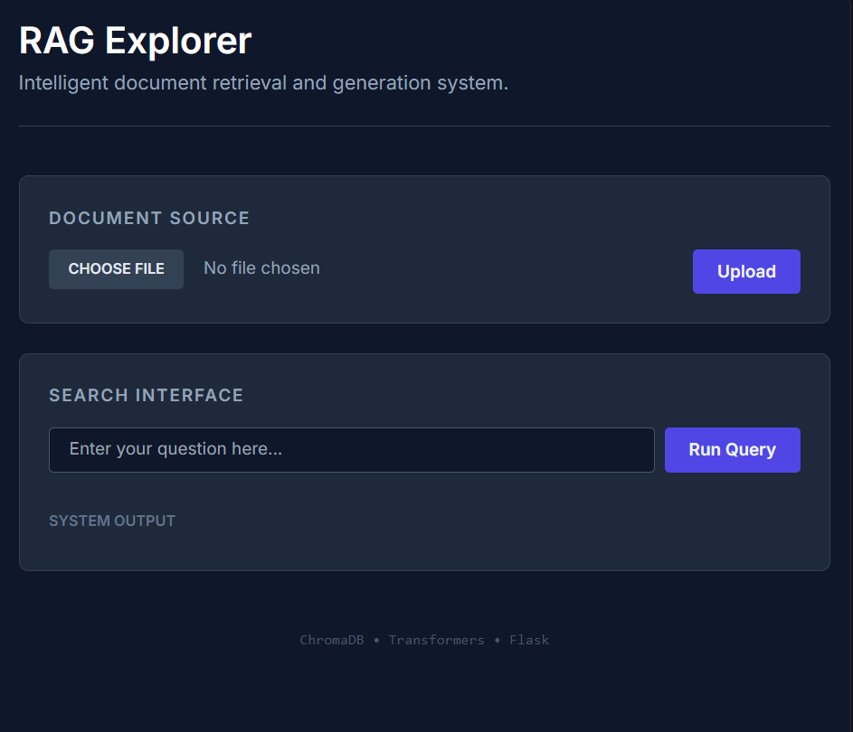

# LLM RAG System — Intelligent Document QA & Semantic Search

A complete implementation of a Large Language Model (LLM) pipeline that combines:

* Pre-trained Transformers (GPT-2, BERT)
* Semantic Search with Embeddings
* FAISS Vector Indexing
* Retrieval-Augmented Generation (RAG)
* Flask API for real-time interaction

This project demonstrates how modern AI systems move beyond static models to context-aware, knowledge-grounded intelligent systems.

---

## Key Features

* Text generation using GPT-2
* Fill-mask predictions using BERT
* Question answering with transformer pipelines
* Semantic search using sentence embeddings
* Fast similarity search using FAISS
* RAG pipeline for context-aware answers
* REST API with Flask
* Basic conversational memory support

---

## System Architecture

```
User Query
    ↓
Embedding Model
    ↓
Vector Database (FAISS / ChromaDB)
    ↓
Relevant Context Retrieval
    ↓
LLM (GPT-2)
    ↓
Generated Answer
```

---

## Web Interface

The system includes a web-based interface for uploading documents and performing context-aware question answering using the RAG pipeline.



---

## Project Structure

```
week-12-LLM-and-RAG/
│
├── llm_basics.py
├── semantic_search.py
├── rag_system.py
├── flask_rag_api.py
│
├── data/
│   └── documents.txt
│
├── embeddings/
│   └── faiss_index.bin
│
├── templates/
│   └── index.html
│
├── screenshots/
│   └── UI.PNG
│
└── requirements.txt
```

---

## Installation

```bash
git clone https://github.com/HamzaAhmadOfficial/week-12-LLM-and-RAG.git
cd week-12-LLM-and-RAG

pip install -r requirements.txt
```

---

## Usage

### Run LLM Basics

```bash
python llm_basics.py
```

### Run Semantic Search

```bash
python semantic_search.py
```

### Run RAG System

```bash
python rag_system.py
```

### Run Flask API

```bash
python flask_rag_api.py
```

Then open in browser:

```
http://127.0.0.1:5000/
```

---

## Example Use Cases

* Document Question Answering
* Knowledge Retrieval Systems
* Intelligent Search Engines
* AI Assistants
* Enterprise Knowledge Bases

---

## Technologies Used

* Python
* Hugging Face Transformers
* Sentence Transformers
* FAISS
* ChromaDB
* Flask

---

## Learning Outcomes

* Understanding transformer-based NLP models
* Difference between keyword and semantic search
* Role of embeddings in AI systems
* Implementation of RAG architecture
* Building APIs for AI applications

---

## Future Improvements

* PDF document parsing (PyMuPDF)
* Multi-turn conversation memory
* Streamlit or React frontend
* Deployment using Docker or cloud platforms
* Integration with advanced LLM APIs

---

## Author

Hamza Ahmad
AI/ML Engineer | Data Scientist

---

## Contributing

Contributions are welcome. Feel free to fork the repository and submit pull requests.

---

## License

This project is for educational and research purposes.
